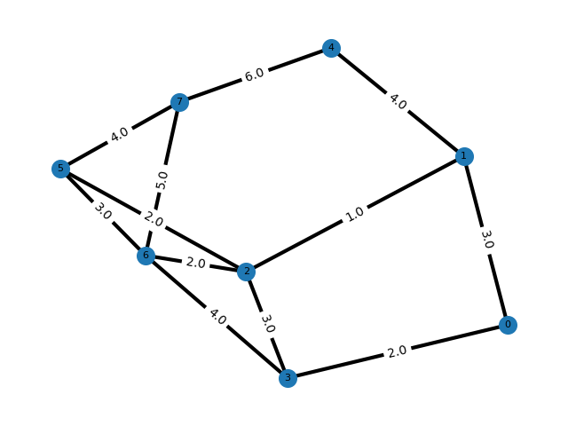
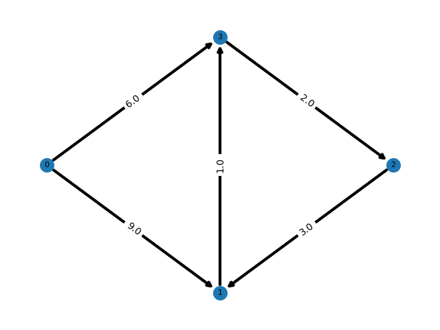
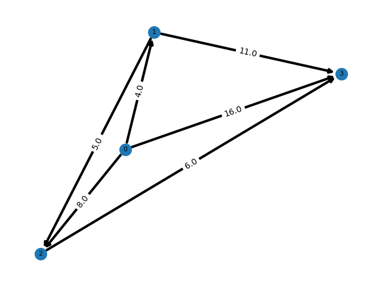

# Práctica 6: Algoritmo de Dijkstra

## Integrantes

- Domíminguez León José Miguel
- Lazcano Flores Valeria
- Sánchez García Rafael

## Uso e instalación

Aquí escribe qué necesitas que instale para ejecutar tu código, por ejemplo:

- `matplotlib` : el cual se importa como plt; instalamos inf 
- `numpy` : el  cual se importa como np; instalamos la función zeros
- `pandas` : el cual se importa como pd.
- `networkx` : el cual se importa como nx.

Manera de ejecutar el código y en qué orden:
- `data.py`: Ejecutamos primero este archivo donde se lee el csv para covertirlo en un dataFrame y posteriormente poder utilizar la función para crear una matriz de adyacencia 
- `models.py`: Contiene el código de las funciones principales que se utilizarán en los ejercicios.
- `main.py`: Contiene el código para resolver y graficar cada uno de los tres ejercicios.

## Introducción 
El problema de encontrar rutas óptimas en redes es fundamental en diversas áreas como transporte, telecomunicaciones y ciencias de la computación. En particular, los grafos ponderados permiten modelar situaciones donde las conexiones entre nodos tienen un costo asociado, como distancia, tiempo o peso.

Un grafo dirigido ponderado se define como una estructura G = (V, E) , donde  V  es el conjunto de vértices y E  el conjunto de aristas dirigidas, cada una con un peso asociado. Este peso representa el costo de trasladarse de un nodo a otro.

El algoritmo de Dijkstra es una herramienta fundamental para resolver el problema del camino más corto desde un nodo origen hacia todos los demás nodos en un grafo con pesos no negativos. Su eficiencia y simplicidad lo convierten en uno de los algoritmos más utilizados en optimización de rutas.
- ¿Cómo funciona el algoritmo?

El algoritmo de Dijkstra es un método iterativo que construye progresivamente las distancias mínimas desde un nodo origen hacia todos los demás nodos del grafo.

Sea una matriz de adyacencia $( M )$, donde:

$$
M[u][v] =
\begin{cases}
w & \text{si existe una arista de } u \rightarrow v \\
\infty & \text{en otro caso}
\end{cases}
$$

Se define un arreglo de distancias $( D )$ tal que:

$$
D[v] = \text{distancia mínima conocida desde el origen hasta } v
$$

Inicialmente:

$$
D[v] =
\begin{cases}
0 & \text{si } v = \text{origen} \\
\infty & \text{en otro caso}
\end{cases}
$$

---
El algoritmo sigue los siguientes pasos:

1. **Inicialización:**  
   Se asigna distancia infinita a todos los nodos excepto al origen.

2. **Selección del nodo permanente:**  
   Se elige el nodo no visitado con menor distancia.

3. **Relajación (reetiquetado):**  
   Para cada vecino \( v \) del nodo seleccionado \( u \), se actualiza:

   $$D[v] = \min(D[v],\; D[u] + M[u][v])$$

4. **Actualización de predecesores:**  
   Si la distancia mejora, se registra el nodo previo:

   $$P[v] = u$$

5. **Repetición:**  
   El proceso continúa hasta que todos los nodos han sido visitados o no hay más nodos alcanzables.  

El resultado final es un conjunto de distancias mínimas y un arreglo de predecesores que permite reconstruir los caminos óptimos.

## Ejercicio 1

En el Ejercicio 1 se proporciona una matriz de adyacencia de tamaño ($4 \times 4$ ), la cual representa un grafo dirigido ponderado. El objetivo es calcular las distancias mínimas desde el nodo inicial ( 0 ) hacia todos los demás nodos.
Tras aplicar el algoritmo de Dijkstra, se obtiene un arreglo de distancias:

$$
D = [0, 9, 8, 6]
$$

Esto indica que:

- La distancia de $( 0 \rightarrow 1 )$ es 9  
- La distancia de $( 0 \rightarrow 3 )$ es 6  
- La distancia de $( 0 \rightarrow 2 )$ es 8  

Es importante notar que la distancia hacia el nodo 2 no es directa, sino que se obtiene mediante un camino intermedio:

$$
0 \rightarrow 3 \rightarrow 2
$$

con un costo total:

$$
6 + 2 = 8
$$

El arreglo de predecesores obtenido es:

$$
P = [-1, 0, 3, 0]
$$

lo cual confirma la estructura del camino mínimo, indicando que el nodo 2 se alcanza desde el nodo 3, y el nodo 3 desde el nodo 0. Así, se valida el correcto funcionamiento del algoritmo, ya que los resultados coinciden con los cálculos teóricos.

## Ejercicio 2 

El Ejercicio 2 consiste en reconstruir el camino mínimo entre dos nodos utilizando el arreglo de predecesores obtenido mediante el algoritmo de Dijkstra.

El procedimiento consiste en partir del nodo destino y seguir los predecesores hasta llegar al origen:

$$
\text{camino} = \{ \text{destination},\; P[\text{destination}],\; P[P[\text{destination}]],\; \dots,\; \text{origin} \}
$$

Posteriormente, el camino se invierte para obtener la secuencia correcta.

Por ejemplo, para encontrar el camino de $0 \rightarrow 2$:

- $P[2] = 3$  
- $P[3] = 0$ 

Por lo tanto, el camino es:

$$
0 \rightarrow 3 \rightarrow 2
$$

Este resultado coincide con el obtenido en el Ejercicio 1 y confirma que el algoritmo no solo proporciona la distancia mínima, sino también la estructura del recorrido óptimo.

## Ejercicio 3

El ejercicio 3 consiste en que dada una matriz de pesos, encontremos las distancias mínimas entre nodos para cada uno de ellos. Construimos una función para cada matriz dada (dirigida o no dirigida), donde ya se nos proporciona la matriz $(M_1, M_2, M_3)$, posteriormente para cada función de cada matriz hacemos un for que recorra cada lugar de la matriz $M_r[i][j]$ $( r \in \{1,2,3}\)$ y en caso de que $i \neq j$ y $M_r[i][j] = 0$ hacemos a $M_r[i][j] = inf$ pues $inf$ representa que no existe un peso entre estos nodos.
Aplicando la función .tolist() para que las matrices se conviertan en listas, y por último aplicamos la función dijkstra donde para $i = j$ es $M_r[i][j] = 0$, y calcula la distancia mínima de nodo a nodo.

Gráfica de $M_1$

Gráfica de $M_2$

Gráfica de $M_3$

## Conclusión
El desarrollo de esta práctica permitió comprender e implementar el algoritmo de Dijkstra para la resolución del problema de caminos mínimos en grafos ponderados dirigidos. A partir de la construcción de la matriz de adyacencia y la correcta interpretación de los datos, fue posible calcular las distancias mínimas entre nodos y reconstruir los caminos óptimos mediante el uso de arreglos auxiliares.
En particular, el algoritmo de Dijkstra destaca por su claridad conceptual y su aplicabilidad en problemas reales, como la optimización de rutas en redes de transporte o comunicación. La práctica también permitió reforzar habilidades de programación, organización del código y análisis de resultados, elementos fundamentales en la formación en ciencias computacionales.

**Reflexión sobre programación dinámica**

La programación dinámica es una técnica algorítmica que consiste en dividir un problema en subproblemas más pequeños y almacenar sus soluciones para evitar cálculos repetitivos. Aunque el algoritmo de Dijkstra no es un ejemplo directo de programación dinámica (porque no recalcula subproblemas, cada nodo se vuelve permanente UNA sola vez, ie, nunca lo vuelve a recalcular), comparte ciertas ideas como la construcción progresiva de soluciones óptimas a partir de resultados previos.

Desde mi perspectiva, la programación dinámica es una estrategia interesante y potencialmente muy útil, especialmente en problemas donde existen subestructuras óptimas y superposición de subproblemas. Sin embargo, requiere un nivel de abstracción mayor y una buena comprensión del problema para identificar cuándo puede aplicarse correctamente.

En relación con la práctica realizada, considero que aunque no se utilizó programación dinámica de forma directa, el enfoque algorítmico empleado permite entender la importancia de estructurar soluciones eficientes y evitar cálculos innecesarios. En este sentido, sí considero que este tipo de estrategias serán útiles en el futuro, particularmente en problemas más complejos dentro de la computación.

En conclusión, la programación dinámica representa una herramienta poderosa para la resolución de problemas, y aunque aún se encuentra en proceso de comprensión, su estudio será de gran utilidad en el desarrollo de habilidades algorítmicas.

